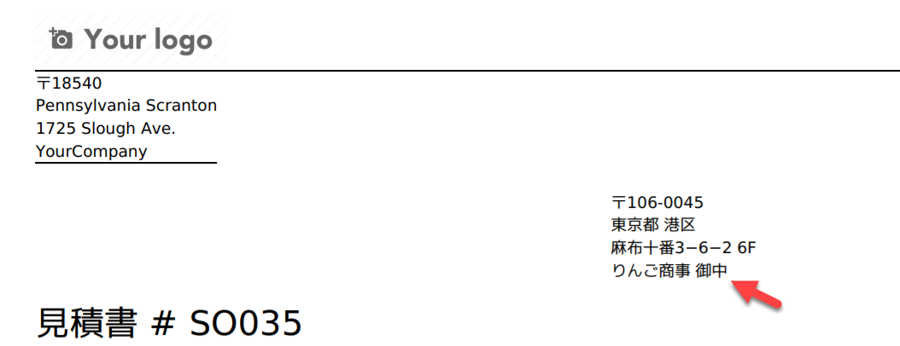

.. image:: https://img.shields.io/badge/licence-LGPL--3-blue.png
    :target: http://www.gnu.org/licenses/lgpl-3.0-standalone.html
    :alt: License: LGPL-3

========================
Japan Partner Title QWeb
========================

This module makes necessary adjustments to show title ("様" for individuals,
"御中" for companies) for partner names in QWeb reports.

Configuration and Usage
=======================

* This module creates "様" and "御中" title records upon installation.
* When you update company type (individual/company) or language of a partner,
  the system will propose title according to your selection (by default,
  "様"/"御中" will only be proposed when language is Japanese).
* Selected title of the partner should show in printed QWeb reports.

.. image:: https://odoo-community.org/website/image/ir.attachment/5784_f2813bd/datas
    :alt: Try me on Runbot
    :target: https://runbot.odoo-community.org/runbot/257/11.0

Bug Tracker
===========

Bugs are tracked on `GitHub Issues
<https://github.com/OCA/l10n-japan/issues>`_. In case of trouble, please
check there if your issue has already been reported. If you spotted it first,
help us smashing it by providing a detailed and welcomed feedback.

Credits
=======

Contributors
------------

* Tim Lai <tl@quartile.co>
* Takuya Sawada <takuya@tuntunkun.com>
* Yoshi Tashiro <tashiro@quartile.co>

Maintainer
----------

.. image:: https://odoo-community.org/logo.png
    :alt: Odoo Community Association
    :target: https://odoo-community.org

This module is maintained by the OCA.

OCA, or the Odoo Community Association, is a nonprofit organization whose
mission is to support the collaborative development of Odoo features and
promote its widespread use.

To contribute to this module, please visit https://odoo-community.org.
